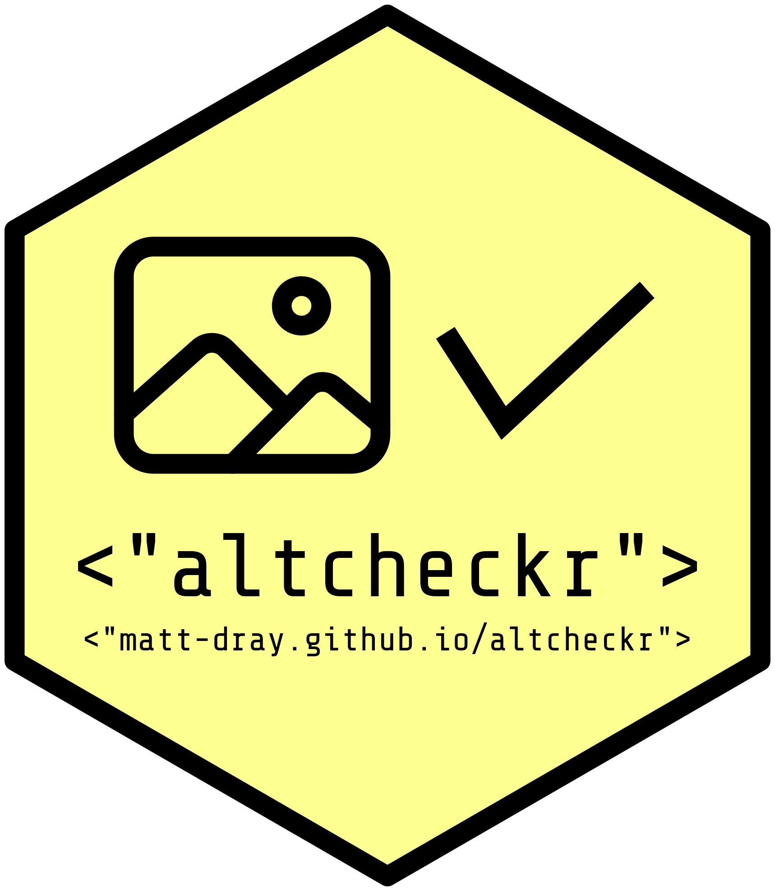

# altcheckr 

An in-development R package to assess the alternative (alt) text from a web page.

<!-- badges: start -->
[](https://www.tidyverse.org/lifecycle/#experimental)
[](https://travis-ci.org/matt-dray/altcheckr)
[](https://codecov.io/github/matt-dray/altcheckr?branch=master)
[](https://www.rostrum.blog/2019/12/08/altcheckr/)
<!-- badges: end -->

## Description

Scrape image element attributes from a webpage, detect alternative (alt) text and assess it with simple heuristics. Alt text is important for users of assistive technologies, like screen readers, for understanding the content of images. This package should be used in conjunction with other accessibility assessment tools for more comprehensive coverage.

[Read more about this package in the accompanying blog post.](https://www.rostrum.blog/2019/12/08/altcheckr/)

## Use

Install from GitHub using the {remotes} package:

```
install.packages("remotes")
remotes::install_github("matt-dray/altcheckr")
library(altcheckr)
```

There are two major functions for now:

* `alt_get()` creates a tibble of HTML attributes for each 'img' element on a supplied web page
* `alt_check()` performs basic checks of the alt text for each image

See the 'introduction to {altcheckr} functions' vignette for more information: run `vignette("introduction", altcheckr)` or visit [the {altcheckr} website](https://www.matt-dray.github.io/altcheckr/articles/introduction.html).

Right now, the `alt_check()` function flags when alt text:

* is missing (but this is okay if the image is decorative)
* is noticeably short or long (length can be controlled by the user)
* contains self-evident phrases ('image of', 'picture of', etc)
* is missing terminal punctuation, which interferes with how the sentence is parsed

And it also:

* highlights words that may be misspelled, via the {hunspell} package
* returns a list of words that don't appear to be basic English

## Links

* Wikipedia's page for [the alt attribute](https://en.wikipedia.org/wiki/Alt_attribute)
* W3C's [web accessibility tutorials on images](https://www.w3.org/WAI/tutorials/images/), including [a decision tree for using alt text](https://www.w3.org/WAI/tutorials/images/decision-tree/)
* Web Content Accessibility Guidelines (WCAG) [overview](https://www.w3.org/WAI/standards-guidelines/wcag/)
* Royal National Institute of Blind People's (RNIB) [accessibility guidelines for alt text](https://www.rnib.org.uk/accessibility-guidelines-alt-text-what-you-need-know)

## Code of conduct

Please note that the 'altcheckr' project is released with a [Contributor Code of Conduct](CODE_OF_CONDUCT.md). By contributing to this project, you agree to abide by its terms.
